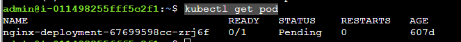
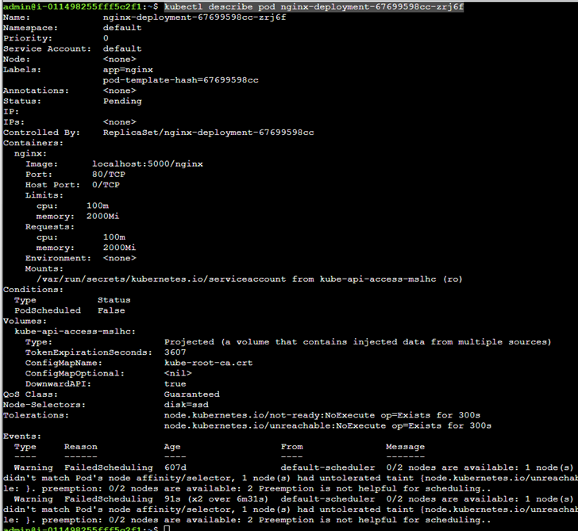
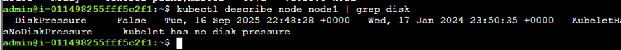
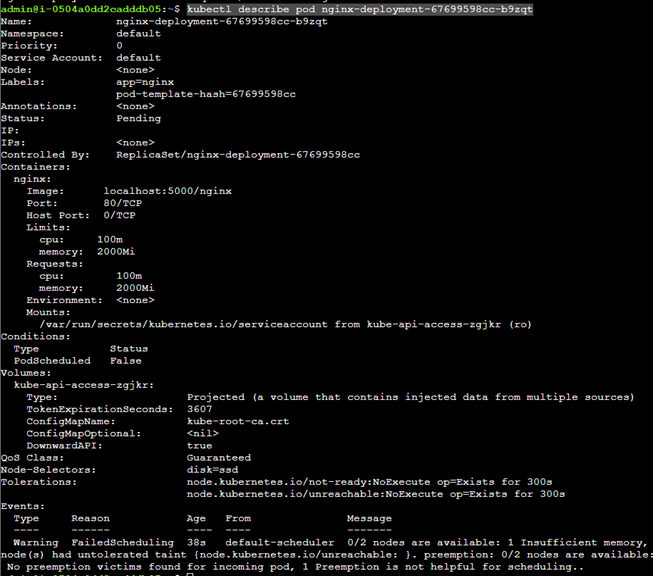
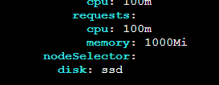
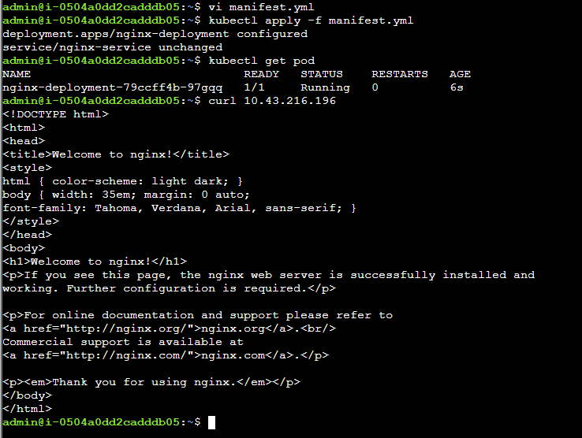

## Notes and solution

## Description
## There's a Kubernetes Deployment with an Nginx pod and a Load Balancer declared in the manifest.yml file. The pod is not coming up. Fix it so that you can access the Nginx container through the Load Balancer.

```bash
kubectl get pod
```



Checking the pods even further

```bash
kubectl describe pod nginx-deployment-67699598cc-zrj6f
```

Can see there is an issue with the selector



Can also review disk associated with the node

```bash
kubectl describe node node1 | grep disk
```



Now will need to make the disk consistent between the pod and node

```bash
kubectl label nodes node1 disk=ssd
```
```bash
kubectl describe node node1 | grep disk
```
Can now delete pod which is now re-scheduled

```bash
kubectl delete pod nginx-deployment-67699598cc-zrj6f
```

```bash
kubectl describe pod nginx-deployment-67699598cc-b9zqt
```


And it appears the memory requests are too large which can 
Can navigate to the manifest file and reduce the memory requests, as the scheduler will only place this Pod on a node with at least 2 GiB of unallocated memory



Can then apply the manifest file using the below

```bash
kubectl apply -f manifest.yml
```

```bash
kubectl get pod
```

And can now curl




