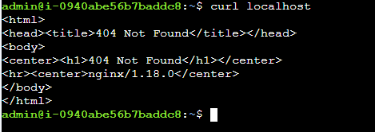
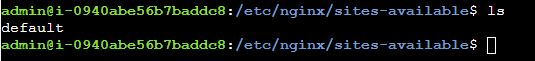
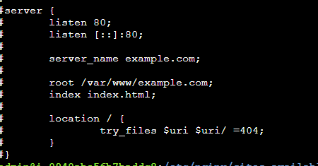
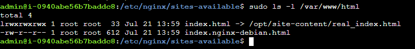
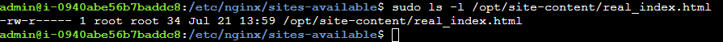
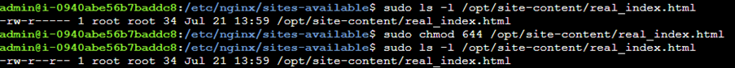
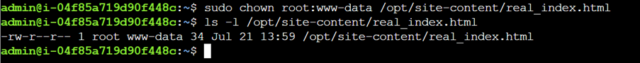
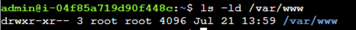
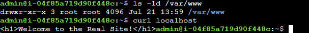

## Notes and solution

## Description
## There's a web server running on this host but curl localhost returns the default 404 Not Found page, will need to fix the issue so that a file is served correctly and the message Welcome to the Real Site! is returned.

```bash
curl localhost
```


Next will need to review the Nginx settings before making any changes.

Checking there is a default file available



And can see it is serving the file in the following file path

```bash
root /var/www/example.com
```


Now checking the file contents

```bash
sudo ls -l /var/www/html
```


And can see it is being re-directed to the below

```bash
/opt/site-content/real_index.html
```
Also checking the permissions for real_index.html

```bash
sudo ls -l /opt/site-content/real_index.html
```



Can see that index.html does not have the same permissions as real_index.html and index.html does not have read permissions for neither the group or others

```bash
sudo chmod 644 /opt/site-content/real_index.html
```


Now since /var/www is owned by ‘www-data’ it will also need to own /opt/site-content/real_index.html

Can also give ownership to the group ‘www-data’



Next let’s see the permissions for the directory

```bash
ls -ld /var/www
```


Can see that others cannot read nor execute, will need to give others the permission to execute in the directory. 

And can now test and it displays the site

```bash
sudo chmod o+x /var/www
curl localhost
```



