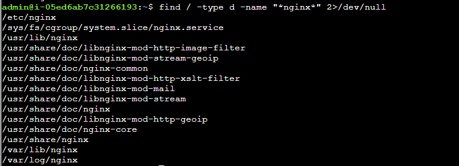
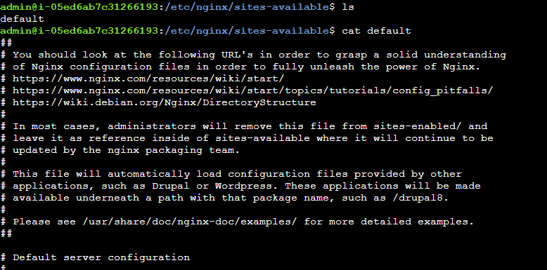
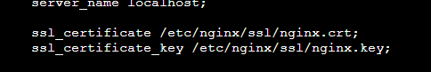
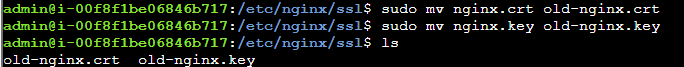
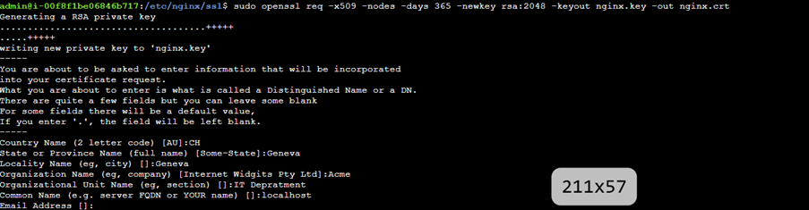
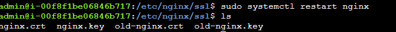
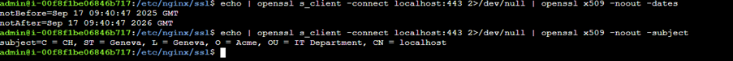
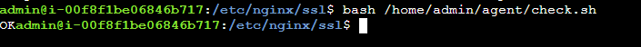

## Notes and solution

## Description
## There's an Nginx web server running on this machine, configured to serve a simple "Hello, World!" page over HTTPS. However, the SSL certificate is expired. The objective is to create a SSL certificate for the Nginx web server with the same Issuer and Subject (same domain and company information).

Running the below command and can see that it the SSL certificate has now expired

```bash
echo | openssl s_client -connect localhost:443 2>/dev/null | openssl x509 -noout -dates
```


Let’s see where nginx is configured

```bash
find / -type d -name "*nginx*" 2>/dev/null
```


/etc contains system-wide configuration files and shell scripts that are used to boot and configure the system

Also checking the Nginx configuration for SSL settings



Can see the SSL configuration



Using the below documentation, can generate a new SSL certificate

https://www.digitalocean.com/community/tutorials/how-to-create-a-self-signed-ssl-certificate-for-nginx-on-centos-7#step-1-create-the-ssl-certificate

Before generating the certificate can rename the crt and key before generating a new one

```bash
sudo mv nginx.crt old-nginx.crt
sudo mv nginx.key old-nginx.key
```


```bash
sudo openssl req -x509 -nodes -days 365 -newkey rsa:2048 -keyout nginx.key -out nginx.crt
```


Which has generated the new SSL certs and can now re-load nginx configuration



Now testing if the certificate has been renewed

```bash
echo | openssl s_client -connect localhost:443 2>/dev/null | openssl x509 -noout -dates
```


Also checking the solution

```bash
bash /home/admin/agent/check.sh
```



