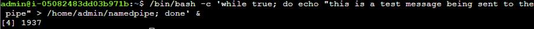
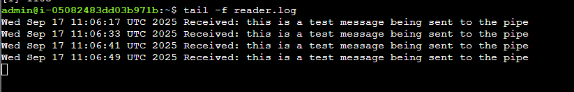
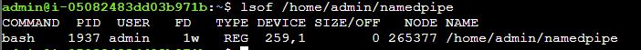
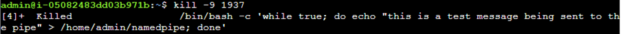
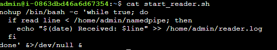
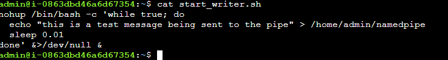
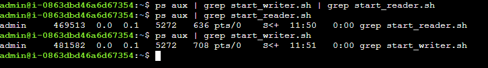
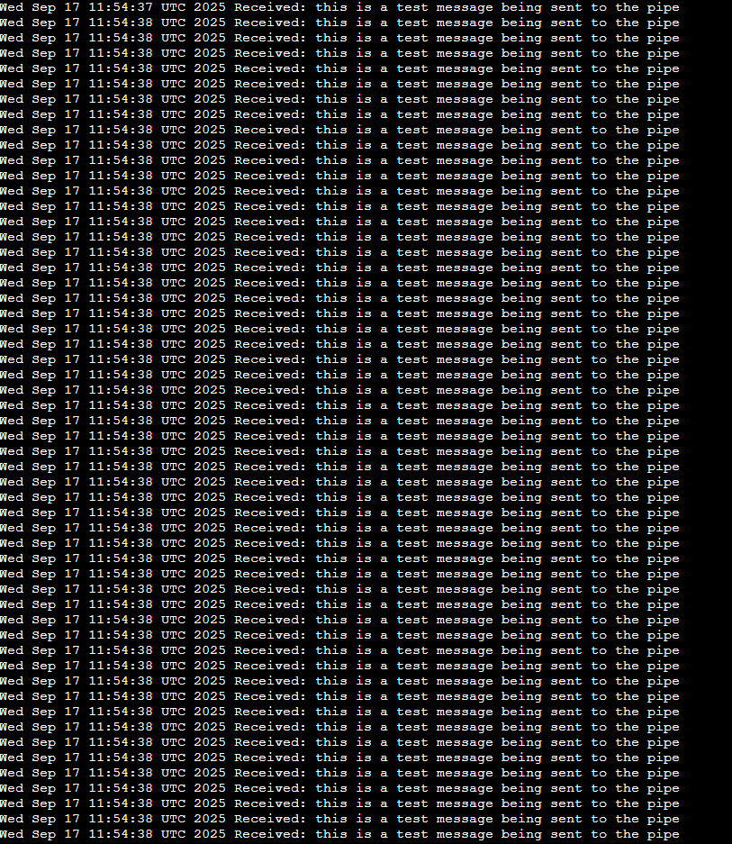

## Notes and solution

## Description
## The writer initially sends messages to the pipe, but eventually stalls because it overwhelms the pipe or the reader is too slow. Adding a small delay in the writer and removing delays in the reader ensures messages are sent and logged continuously without interruption.

If I run the below to the pipe

```bash
/bin/bash -c 'while true; do echo "this is a test message being sent to the pipe" > /home/admin/namedpipe; done' &
```


And then check the reader log

```bash
tail -f reader.log
```

We can see that after a minute or so it works and then it stops working, so the main aim is to troubleshoot and fix vy changing the writer command so that the writer keeps sending the messages and the reader is able to read all of them.



And also checking the process Id

```bash
lsof /home/admin/namedpipe
```


Now will proceed to kill the writer Process



Now will modify the reader script so that there is no delay in reading the reader log

```bash
nohup /bin/bash -c 'while true; do
  if read line < /home/admin/namedpipe; then
    echo "$(date) Received: $line" >> /home/admin/reader.log
  fi
done' &>/dev/null &
```



and configuring the writer script

```bash
nohup /bin/bash -c 'while true; do
  echo "this is a test message being sent to the pipe" > /home/admin/namedpipe
  sleep 0.01
done' &>/dev/null &
```


Executing both

```bash
bash /home/admin/start_reader.sh 
bash /home/admin/start_writer.sh 
```
Checking if the processes are running

```bash
bash /home/admin/start_reader.sh 
bash /home/admin/start_writer.sh 
```
Checking if the processes are running

```bash
ps aux | grep start_reader.sh
ps aux | grep start_writer.sh
```
And can see the processes



Now checking if the pipe is continuing to write the pipe without any delays

```bash
tail -f reader.log
```



